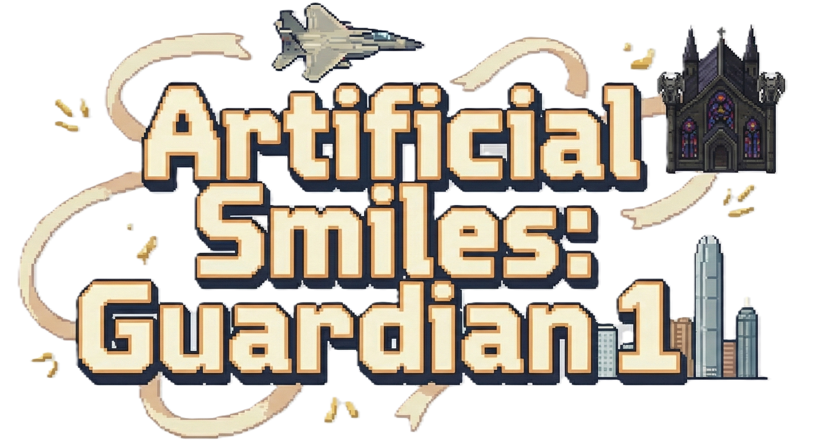

# Programming-for-3D - Artificial Smiles: Guardian 1


This repository contains **Artificial Smiles: Guardian 1 (ASG1)**, a 3D flight combat simulator developed using **Unity 6000.4.0b3** for the Year 3 **G6046: Programming for 3D** Game Design module at the **University of Sussex** in January 2026. The game features realistic flight physics, wave-based combat, and a character-driven dystopian narrative set in Hong Kong's airspace.

This game shares the same character settings, story universe, and some audio/UI design elements from my [final year project](https://github.com/dun4law/Final-Year-Project), as they are both games I created in my final year and are part of the same series. However, the gameplay is completely different.

## Demo Video



[📹 Watch the demo video](3.Video/Artificial%20Smiles%20Guardian%201%20Demo%20Reel(480p%20ver).mp4)

## Play the Game

[](https://dunlaw.itch.io/artificial-smiles-guardian-1)

Pre-built versions of Artificial Smiles: Guardian 1 are available on the [Releases page](https://github.com/dun4law/Programming-for-3D/releases).

### Supported Platforms

* **Windows:** Download Windows x86 build
* **Linux:** Download Linux X64 build
* **Web:** Play directly in browser (WebGL)

## How to Play

**Flight Controls:**
- **W/S:** Pitch (nose up/down)
- **A/D:** Roll (bank left/right)
- **Q/E:** Yaw (rudder)
- **Shift/Ctrl:** Throttle (increase/decrease)
- **F:** Toggle flaps

**Combat Controls:**
- **Left Mouse:** Fire cannon
- **Right Mouse / Space:** Fire missile (requires lock)
- **X:** Deploy flares (countermeasures)

**Objectives:**
- Defend Hong Kong's airspace by destroying all enemy aircraft across multiple waves
- Achieve S-rank performance through kills, accuracy, and time
- Survive with health above 0% and stay within map boundaries

## Technology Stack

* **Game Engine:** Unity 6000.4.0b3
* **Programming Language:** C#
* **UI Framework:** Unity UI Toolkit
* **Target Platforms:** Windows, Linux, WebGL

## Features

* **9 Playable Aircraft:** F-15, Su-27, MiG-29, F/A-18E, Hawk 200, MiG-21, Tornado, Rafale, Typhoon
* **Realistic Flight Physics:** Aerodynamics, G-force effects, stall mechanics, energy management
* **30-Page Cinematic Story:** Character-driven narrative with 7 distinct characters
* **Progression System:** 20-rank system, per-aircraft statistics, badges/achievements
* **3D Hangar:** Interactive aircraft preview with detailed statistics
* **Comprehensive Tutorial:** 12-section "How to Play" guide with rebindable controls

## Installation (Development)

To work with the Unity project:

1. Install Unity Hub and Unity 6000.4.0b3
2. Clone this repository
3. Open the `1.Codebase` folder in Unity Hub
4. Open the project in Unity Editor

## Project Structure

```
Programming-for-3D/
├── 1.Codebase/          # Unity project files
│   ├── Assets/          # Game assets and scripts
│   ├── Packages/        # Unity packages
│   └── ProjectSettings/ # Project configuration
├── 2.V1.0 Built Game/   # Pre-built game executables
│   ├── V1.0 Windows X86/
│   ├── V1.0 Linux/
│   └── V1.0 Web Build/
├── 3.Video/             # Demonstration videos
└── 4.Report/            # Documentation and GDD
```

## Credits

**Developer:** Duncan Law

**Aircraft Models:** Various sources (see in-game Credits > Aircraft tab)

**Audio:** Various sources (see in-game Credits > Audio tab)

**Icons:** game-icons.net (CC BY 3.0)

## License

This project is licensed under the MIT License - see the [LICENSE](LICENSE) file for details.
